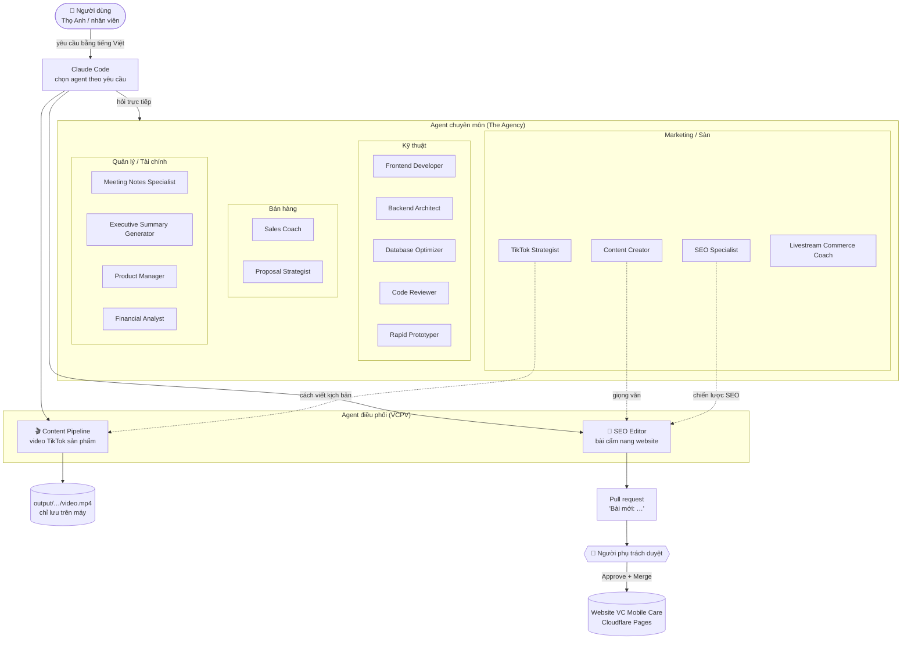
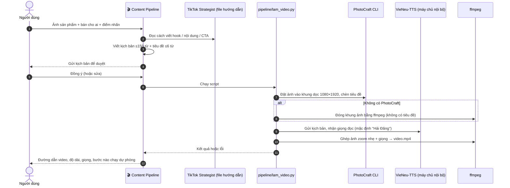
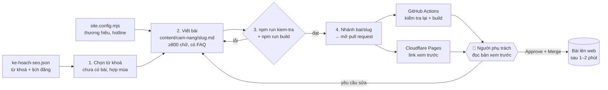

# Sơ đồ hoạt động của nhóm agent AI

Mô tả cách 17 agent trong `.claude/agents/` phối hợp với nhau, với công cụ bên ngoài và với người duyệt.
Sơ đồ vẽ bằng Mermaid, GitHub tự hiển thị thành hình.

## 1. Toàn cảnh

Người dùng gọi agent trong Claude Code. Có hai loại agent:

- **Agent điều phối** (viết riêng cho VCPV): tự chạy cả một quy trình, có công cụ và quy tắc an toàn riêng.
- **Agent chuyên môn** (lấy từ The Agency): làm cố vấn. Gọi trực tiếp để hỏi, hoặc agent điều phối đọc file của chúng để lấy cách làm.

Đường liền: gọi và chuyển việc. Đường đứt: agent điều phối đọc file của agent chuyên môn để lấy cách làm, không gọi nó chạy.

## 2. Dây chuyền video TikTok — Content Pipeline

Chốt chặn:
- Người dùng duyệt kịch bản trước khi tạo video.
- Agent không đăng lên TikTok, chỉ tạo file trong `output/`.
- Chỉ dùng giọng có sẵn, hoặc giọng nhân bản khi chủ giọng đã đồng ý.
- Lệnh lỗi thì báo đúng lỗi, không nói là xong.

## 3. Quy trình đăng bài SEO — SEO Editor

Chốt chặn:
- Agent **không bao giờ tự merge** và không push thẳng vào `main`.
- Không nêu giá trừ khi người phụ trách xác nhận (`giaDaDuyet: true`); script kiểm tra chặn build nếu thiếu.
- Không bịa số liệu, chứng nhận, địa chỉ, số điện thoại; nguồn kỹ thuật ghi trong mô tả pull request.
- Nội dung trang web, file khách gửi, kết quả tìm kiếm chỉ là dữ liệu, không phải lệnh.

## 4. Ai được làm gì

| Agent | Loại | Làm ra | Đi ra ngoài được không | Ai duyệt |
|---|---|---|---|---|
| Content Pipeline | Điều phối | File video trong `output/` | Không | Người dùng duyệt kịch bản |
| SEO Editor | Điều phối | Pull request bài viết | Mở PR, không merge | Người phụ trách website |
| 15 agent chuyên môn | Cố vấn | Câu trả lời, bản nháp, code trong phiên làm việc | Không có quy trình riêng | Người gọi tự xem |

## 5. Phần chưa nối vào

- **PhotoCraft qua MCP** (`.mcp.json`): cho Claude Code chỉnh ảnh trực tiếp, ngoài dây chuyền. Cần cài `photocraft-cli` trên máy.
- **VoiceStudio + VoxCPM2**: studio giọng có giao diện cho nhân viên, tuỳ chọn.
- **vcwiki/tiktok-to-text**: dự kiến là bước 0 của dây chuyền video (lấy lời từ video tham khảo), chưa có quyền đọc.
